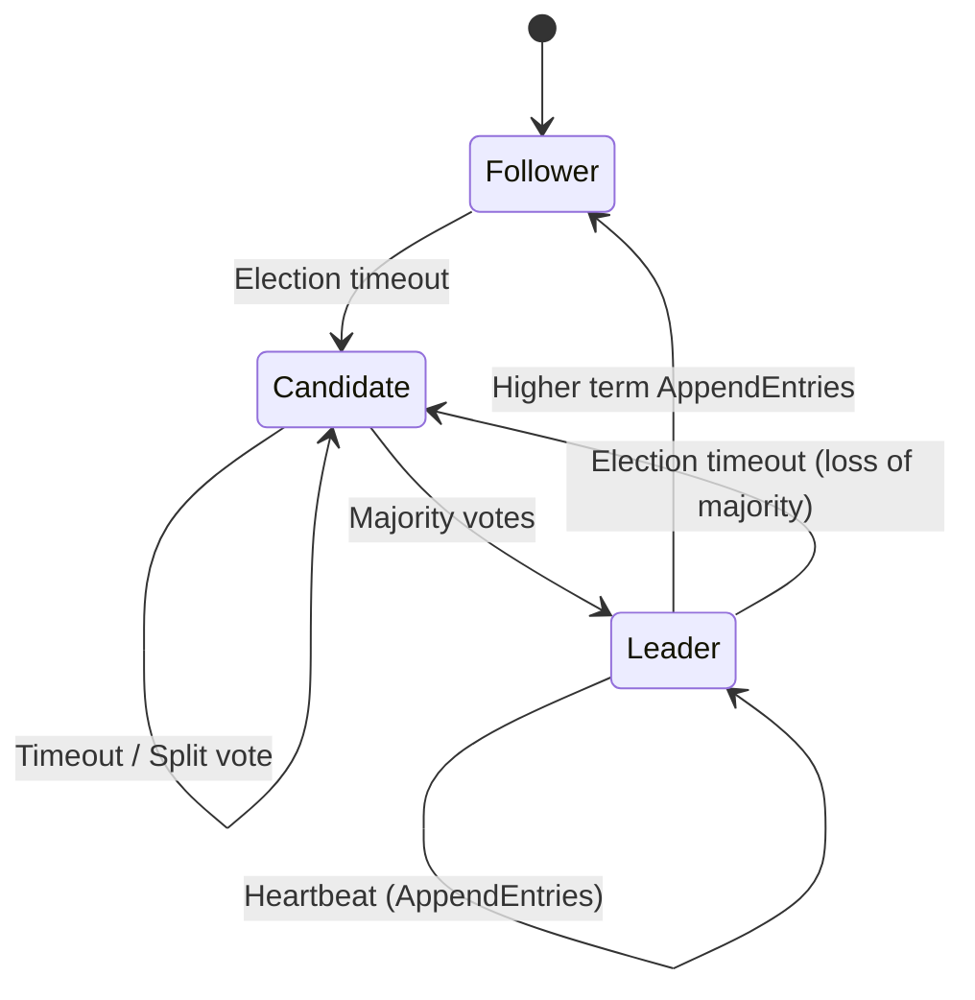

- 마지막 업데이트: 2025-09-25
- 상태: 검토중

# 개요
## RAFT(Raft Consensus Algorithm) 알고리즘
- **TL;DR**: 리더를 선출해 로그 복제를 단순화한 분산 합의 알고리즘으로, 리더 선출·로그 복제·안전성 세 단계로 이해하면 구조가 빠르게 잡힌다.
- Raft는 Paxos보다 이해하기 쉬운 합의 절차를 목표로 설계되었으며, 리더가 모든 클라이언트 요청을 직렬화한다.
- 상태 전이와 타이머 기반 선거 타임라인은 아래 Mermaid 다이어그램 또는 `drawio/raft_leader_election.drawio`에서 확인할 수 있다.

# 핵심 개념
- **용어**: Term(선거 회차), Leader(로그 수신 담당), Candidate(선거 중 노드), Follower(리더 명령 수행).
- **리더 선출(Election)**: 타임아웃이 만료된 Follower가 Candidate로 승격되어 투표를 요청하며, 과반을 얻으면 리더가 된다.
- **로그 복제(AppendEntries)**: 리더가 클라이언트 요청을 로그에 추가하고 Follower에게 AppendEntries RPC를 전송, 과반 ACK 후 Commit Index를 증가시킨다.
- **안전성(Safety)**: 리더는 항상 자신의 로그가 가장 최신이어야 하고, 커밋된 로그는 재선거 후에도 보존된다(Leader Completeness, Log Matching).

# 실무/시험 포인트
- 선거 타임아웃은 클러스터 노드 간 네트워크 지연보다 충분히 길게(예: 150~300ms 랜덤) 설정해 동시 선거 폭발을 방지한다.
- 로그 압축(Snapshot)을 주기적으로 수행해 저장공간을 관리하고, `lastIncludedTerm`/`lastIncludedIndex`를 통해 일관성을 유지한다.
- Kubernetes/etcd, Consul, Nomad 등 Raft 기반 시스템에서 장애 조치 시 Leader가 단일 노드에 몰리지 않도록 `preVote` 기능을 활용한다.
- 시험에서는 "과반" 조건, `AppendEntries` 실패 시 재전송 방식, `term` 비교 순서를 묻는 문제가 빈출한다.

# TODO / 후속 연구
- [x] 리더 선출/로그 복제 요약 정리
- [ ] `drawio/raft_leader_election.drawio`에 Follower → Candidate 타임라인 보강(네트워크 파티션 시나리오 추가)
- [ ] Snapshot/Log Compaction 절차 예제 추가
- [ ] 실제 구현(etcd, HashiCorp Raft) 구성 파일 비교

# 참고 자료
- [In Search of an Understandable Consensus Algorithm](https://raft.github.io/raft.pdf)
- [The Secret Lives of Data – Raft Visualization](https://thesecretlivesofdata.com/raft/)
- [etcd Raft README](https://github.com/etcd-io/etcd/blob/main/raft/README.md)
