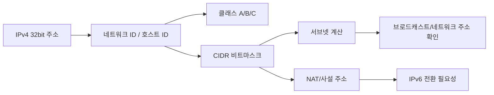

- 마지막 업데이트: 2025-09-25
- 상태: 검토중

# 개요
## IPv4 Header


## IPv4(Internet Protocol version 4 )
Pv4주소는 전화번호와 같이 국내에서 표준을 정하고 정책을 수립하여 이용자에게 무한히 할당할 수 있는 자원이 아니라 전 세계적으로관리되는 유한한 자원입니다(약 43억개).
<br/>일부는 특수한 목적으로 예약되었으며, 주소 규정에 의하여 사용이 제한적이기 때문에 IP주소할당 정책에 따라 부여하여 사용합니다.

## IP 구성
IPv4주소는 인터넷주소자원 관리기관에서 부여한 네트워크 주소와 네트워크 상의 개별 호스트를 식별하기 위하여 네트워크 관리자가 부여한 호스트 주소로 구성됩니다.
<br/> IPv4주소는 네트워크의 크기나 호스트의 수에 따라 A, B, C, D, E 클래스로 나누어집니다. A, B, C 클래스는 일반 사용자에게 부여하는 네트워크 구성용, D 클래스는 멀티캐스트용, E 클래스는 향후 사용을 위하여 예약된 주소입니다.


## CIDR에 의한 주소할당

인터넷의 크기가 커짐에 따라 클래스 단위의 IP주소 할당은 라우팅 테이블을 복잡하게 하고, 인터넷 주소공간을 낭비하는 문제점을 야기합니다.
<br/> 이에 따라 클래스의 제한을 두지 않고 필요한 호스트의 수에 따라 적당한 크기의 IP주소를 할당하는 CIDR 방식이 사용됩니다.

CIDR은 기존의 클래스 기반 할당 방법 대신 다양한 길이의 전치부를 이용한 할당 방법을 사용합니다. 클래스 기반 주소 방식에서는 8, 16, 24로 한정된 전치부를 갖는 반면, CIDR에서는 다양한 전치부의 길이를 지원합니다.
<br/> 이에 따라 작게는 32개의 호스트를 갖는 네트워크부터 50,000여개의 호스트를 갖는 다양한 네트워크를 할당할 수 있습니다.

예를 들어 “203.255.208.222/23”과 같은 CIDR에 의한 IPv4주소표기 방식은 IP주소를 2진수 표기법으로 변환하였을 때 나타나는 처음 23비트(11001011 1111111 1101000)가 네트워크 주소로 사용되며 나머지 비트(0 11011110)가 /23 네트워크가 가지는 512개의 호스트 중 자신의 호스트를 식별하는 숫자라는 것을 말합니다.

|CIDR 블록 전치부|	동일한 크기의C 클래스 개수|	네트워크의 호스트 수|
|---|---|---|
|/27|	1/8개|	32개|
|/26|	1/4개|	64개|
|/25|	1/2개|	128개|
|/24|	1개|	256개|
|/23|	2개|	512개|
|/22|	4개|	1,024개|
|/21|	8개|	2,048개|
|/20|	16개|	4,096개|
|/19|	32개|	8,192개|
|/18|	64개|	16,384개|
|/17|	128개|	32,768개|

## IPv4주소의 유한성
IPv4주소는 전화번호와 같이 국내에서 표준을 정하고 정책을 수립하여 이용자에게 무한히 할당할 수 있는 자원이 아니라 전 세계적으로 관리되는 유한한 자원입니다(약 43억개). 일부는 특수한 목적으로 예약되었으며, 주소 규정에 의하여 사용이 제한적이기 때문에 IP주소 할당 정책에 따라 부여하여 사용합니다.

|      네트워크 주소      |   호스트  |        주소유형        |                       목적                      |   
|:-----------------------:|:---------:|:----------------------:|:-----------------------------------------------:|
| 모두 0                  | 모두 0    | 컴퓨터자신             | 부트스트랩 용                                   |   
| 모두 0                  | 호스트    | 해당 네트워크의 호스트 | 연결된 내부 네트워크에 있는<br>특정 호스트 식별 |   
| 네트워크                | 모두 0    | 네트워크               | 네트워크 식별                                   |   
| 네트워크                | 모두 1    | 방향적 방송            | 지정 네트워크 방송                              |   
| 모두 1                  | 모두 1    | 제한된 방송            | 지역 네트워크 방송                              |  
| 127                     | 임의의 값 | Loopback               | 테스트용                                        |   
| 10                      | 호스트    | A 클래스용 사설주소    | 사설망 내부에서 사용                            |   
| 172.16 ~ 172.31         | 호스트    | B 클래스용 사설주소    | 사설망 내부에서 사용                            |   
| 192.168.0 ~ 192.168.255 | 호스트    | C 클래스용 사설주소    | 사설망 내부에서 사용                            |   


출처: https://xn--3e0bx5euxnjje69i70af08bea817g.xn--3e0b707e/jsp/resources/ipv4Info.jsp

# 핵심 개념
- IPv4 주소는 32비트 4옥텟으로 구성되며, `네트워크 ID`와 `호스트 ID`로 나뉜다.
- 클래스풀 주소 체계(A/B/C) 대신 CIDR(가변 길이 프리픽스, `/<prefix>`)로 필요한 규모만큼 주소를 할당한다.
- IPv4 헤더 주요 필드: 버전, IHL, DSCP/ECN, Total Length, Identification/Flags/Fragment Offset, TTL, Protocol, Header Checksum, Source/Destination IP.
- 프래그먼트 재조립은 목적지에서 수행하며, `Identification`과 `Fragment Offset`으로 순서를 판단한다.
- 주소 고갈 문제 때문에 사설 주소(10/8, 172.16/12, 192.168/16)와 NAT, 그리고 IPv6 도입이 병행된다.

# 실무/시험 포인트
- CIDR 서브넷 계산은 시험에서 단골이다. `2^(호스트비트) - 2` 공식으로 사용 가능한 호스트 수를 구한다.
- 네트워크 장비 설정 시 `ip route`, `access-list`, `nat` 명령에서 CIDR 표기(`/24`, `/30`)를 정확히 입력해야 한다.
- 사설 주소 대역이 NAT 장비를 거쳐 공인 IP로 변환되는 흐름을 이해하고, `traceroute`로 경로를 검증해본다.
- 브로드캐스트 주소(`호스트 비트 모두 1`), 네트워크 주소(`호스트 비트 모두 0`)는 할당 불가라는 점에 주의한다.
- TTL(Time To Live)은 루프 방지용이며, `ping`/`traceroute`로 삭감 과정을 확인 가능하다.

## 예제: 서브넷 계산
```
네트워크: 192.168.10.0/26
프리픽스 길이: 26 → 호스트 비트 6 → 호스트 수 2^6 - 2 = 62
첫 번째 서브넷: 192.168.10.0/26 (네트워크: .0, 브로드캐스트: .63)
두 번째 서브넷: 192.168.10.64/26 (네트워크: .64, 브로드캐스트: .127)
```



# TODO / 후속 연구
- [ ] IPv4 프래그먼테이션 예시 패킷 캡처(`tcpdump`) 추가
- [ ] NAT 구성 예제(`iptables` 또는 `cisco ios`)와 흐름도 연결
- [ ] IPv4 고갈 통계 및 IPv6 전환 사례 업데이트

# 참고 자료
- [KISA IPv4 정보](https://xn--3e0bx5euxnjje69i70af08bea817g.xn--3e0b707e/jsp/resources/ipv4Info.jsp)
- [IETF RFC 791 – Internet Protocol](https://www.rfc-editor.org/rfc/rfc791)
- [CIDR Calculator](https://www.ipaddressguide.com/cidr)
